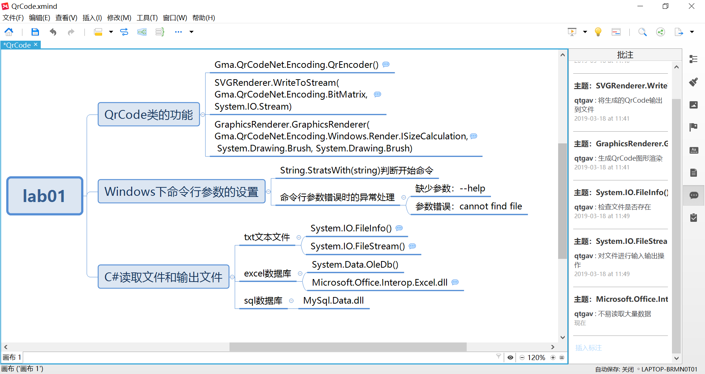

# lab01
C# lab01, by LuYuan, 2019-3-14, lasts 5 hours, 164 lines

## Introduction
1. This application is used to create qrcode for numerous cellphone numbers (11 digits)
2. This app supported command line of Windows System to execute only 
3. This app can only read txt file with encoding UTF8 

## Usage
1. input "-F"/"-f"(captial insensitive) and filename(.txt)
2. input "-help"(captial sensitive) to get help from this readme.md
3. each line will print a qrcode in the console
4. output qrcode is .png format and named by the number of rows and the first four number of the data

## Change Log
#### first version(a941dcb), released in 14:54, March 15th, 2019
1. the default txt file is test.txt
2. the drfault data is 17822007566, 17822007567, 17822007568
3. screencut (by vs complier)    

## xmind

