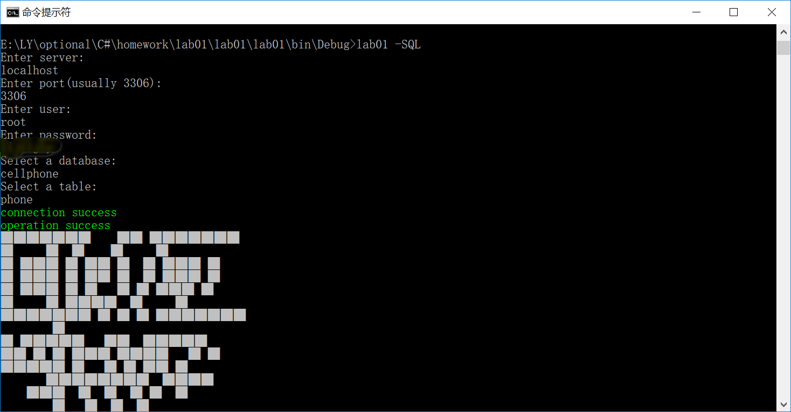
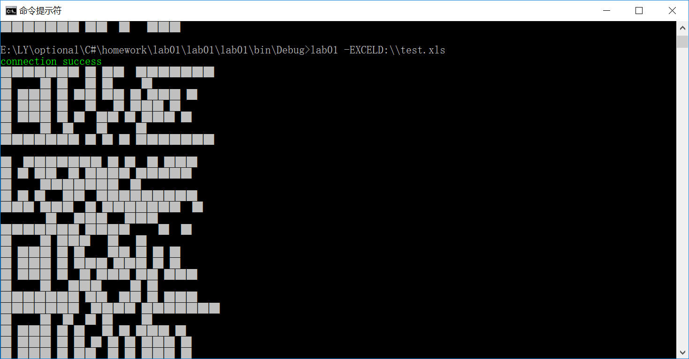

# lab01
C# lab01, by LuYuan, 2019-3-14, lasts 8 hours, 125 lines

## Introduction
1. This application is used to create qrcode for numerous cellphone numbers (11 digits), and the input data must be cellphone numbers(11 digits), or the complier would throw an error
2. This app supported command line of Windows System to execute only 
3. This app can only read txt file with encoding UTF8
4. This app support reading data from sql databases and excel files

## Usage
1. input "-F"/"-f"(captial insensitive) and txt file path(.txt)
2. input "-SQL" to select database by given instructions
3. input "-EXCEL" and excel file path(.xls)
4. input "-help"(captial sensitive) to get help from this readme.md
5. each data will print a qrcode in the console
6. output qrcode is .png format and named by the number of rows and the first four number of the data

## Change Log
#### first version(a941dcb), released in 14:54, March 15th, 2019
1. type of input data must be cellphone numbers(11 digits), or the complier will throw an exception
2. use \n to split different input string
3. screencut (by vs complier) 
4. the default path of photos is in the "debug" folder

#### second version(8146729), released in 9:20, March 27th, 2019
1. add sql data reader, which can read data from sql server
2. if you get connected with your sql server, console will print "connection success" in green foreground
3. if you choose the right table, console will print "operation success" in green foreground
4. the default column of table is "number", please change the name of your table's column to "number" and set it the only column in your table
5. 

#### third version(79f7ca0), released in 0:13, April 2nd, 2019
1. add excel data reader, which support reading data from excel(2007 or later edition)
2. if you get connected with excel file, console will print "connection success" in green foreground
3. the default location of data to be read is in the first column, please set your data in the first column
4. 

## xmind

